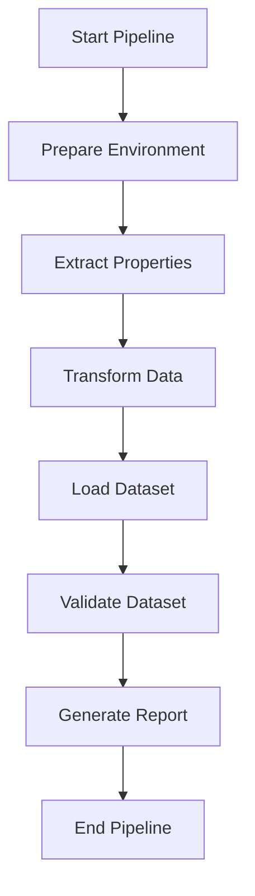

# 🏢 Pipeline ETL de Propiedades Inmobiliarias con Apache Airflow

## 📋 Descripción del Proyecto

Este proyecto implementa un pipeline ETL (Extract, Transform, Load) completo para la obtención y procesamiento automatizado de datos de propiedades inmobiliarias del mercado argentino. Utiliza Apache Airflow para orquestación y está diseñado para ejecutarse en un entorno controlado con Astro CLI.

## 🎯 Problema a Abordar

### Contexto
El mercado inmobiliario argentino carece de datasets públicos actualizados y estructurados que permitan:
- Análisis de tendencias de precios
- Estudios de mercado por zona geográfica
- Desarrollo de modelos predictivos
- Investigación académica y comercial

### Solución
Pipeline automatizado que genera diariamente un dataset limpio y estructurado con:
- **10,000+ propiedades** por ejecución
- **Datos normalizados** y validados
- **Múltiples formatos** de salida
- **Reportes de calidad** automáticos
- **Metadatos completos** del dataset

## 📊 Fuente de Datos

### ArgentProp (www.argenprop.com)
- **Tipo**: Portal inmobiliario líder en Argentina
- **Cobertura**: +100,000 propiedades activas
- **Ubicación**: Capital Federal y Gran Buenos Aires
- **Actualización**: Datos en tiempo real
- **Categorías**: Departamentos, casas, oficinas, terrenos

### Metodología de Extracción
- **Web Scraping ético** con rate limiting
- **Rotación de User-Agents** para evitar bloqueos
- **Manejo robusto de errores** y reintentos
- **Respeto por robots.txt** y términos de servicio

## 🏗️ Arquitectura del Pipeline

### Tecnologías Utilizadas
- **Apache Airflow 2.7+**: Orquestación y scheduling
- **Astro CLI**: Distribución y deployment
- **Python 3.9+**: Lenguaje principal
- **pandas**: Manipulación de datos
- **BeautifulSoup4**: Web scraping
- **Parquet**: Almacenamiento eficiente

### Estructura del DAG



## 📁 Estructura del Proyecto

```
Props-Scraper/
├── dags/
│   └── propiedades_etl_dag.py          # DAG principal de Airflow
├── airflow_utils/
│   ├── __init__.py
│   ├── extraction.py                   # Módulo de extracción
│   ├── transformation.py               # Módulo de transformación
│   └── loading.py                      # Módulo de carga
├── data/                               # Directorio de outputs
├── Dockerfile                          # Configuración Docker para Astro
├── astro.yaml                          # Configuración Astro CLI
├── requirements.txt                    # Dependencias Python
├── test_pipeline_local.py              # Script de pruebas local
└── README_AIRFLOW.md                   # Esta documentación
```

## 🔄 Etapas del Pipeline

### 1. 📥 Extracción (Extract)
**Archivo**: `airflow_utils/extraction.py`

- **Input**: Parámetros de configuración
- **Proceso**:
  - Construcción de URLs de búsqueda
  - Web scraping con control de rate limiting
  - Extracción de metadatos de propiedades
  - Manejo de errores y reintentos
- **Output**: Archivo JSON con datos crudos

**Datos extraídos por propiedad**:
- Título y descripción
- Precio publicado
- Ubicación completa
- Características (habitaciones, baños, superficie)
- URL y enlaces
- Imágenes
- Timestamp de scraping

### 2. 🔄 Transformación (Transform)
**Archivo**: `airflow_utils/transformation.py`

- **Input**: Datos crudos en JSON
- **Proceso**:
  - Limpieza de precios y conversión a valores numéricos
  - Normalización de ubicaciones (barrio, zona, ciudad)
  - Extracción de características numéricas
  - Cálculo de scores de calidad de datos
  - Validación y detección de anomalías
- **Output**: DataFrame optimizado en formato Parquet

**Transformaciones aplicadas**:
- **Precios**: USD 150.000 → 150000.0 (float)
- **Ubicaciones**: "Palermo, Capital Federal" → {barrio: "Palermo", ciudad: "Capital Federal"}
- **Habitaciones**: "3 amb" → 3 (int)
- **Superficie**: "85 m²" → 85.0 (float)

### 3. 💾 Carga (Load)
**Archivo**: `airflow_utils/loading.py`

- **Input**: Datos transformados
- **Proceso**:
  - Generación de dataset en múltiples formatos
  - Creación de reportes estadísticos
  - Generación de metadatos automáticos
  - Validación de integridad
- **Output**: Dataset completo multi-formato

**Formatos generados**:
- **Excel**: Con hojas de estadísticas y calidad
- **CSV**: Para compatibilidad universal
- **Parquet**: Para análisis big data
- **JSON**: Para integración con APIs
- **Metadata**: Documentación del dataset

### 4. ✅ Validación
- Verificación de completitud de datos
- Validación de calidad mínima
- Comprobación de archivos generados
- Generación de reportes de éxito/fallo

## 📊 Calidad de Datos

### Score de Calidad (0-100)
Cada propiedad recibe un score basado en:
- **Precio válido** (30 puntos)
- **Ubicación completa** (25 puntos)
- **Características físicas** (25 puntos)
- **Enlaces válidos** (20 puntos)

### Niveles de Calidad
- **Alta** (80-100): Datos completos y confiables
- **Media** (50-79): Datos parciales pero útiles
- **Baja** (0-49): Datos incompletos

### Métricas de Completitud
- Porcentaje de campos completos por columna
- Distribución de scores de calidad
- Detección de outliers y anomalías

## 🚀 Ejecución del Pipeline

### Usando Astro CLI (Recomendado)

```bash
# 1. Instalar Astro CLI
curl -sSL install.astronomer.io | sudo bash

# 2. Inicializar proyecto
cd Props-Scraper
astro dev init

# 3. Iniciar Airflow localmente
astro dev start

# 4. Acceder a la UI
# http://localhost:8080
# User: admin / Password: admin

# 5. Activar el DAG 'propiedades_etl_pipeline'
```

### Prueba Local (Desarrollo)

```bash
# Ejecutar pipeline completo sin Airflow
python test_pipeline_local.py

# Opciones disponibles:
# 1. Prueba completa del pipeline
# 2. Prueba de componentes individuales  
# 3. Ambas
```

### Configuración del DAG

```python
# Parámetros modificables en el DAG
SCRAPING_CONFIG = {
    'property_type': 'departamentos',    # departamentos, casas
    'operation_type': 'venta',           # venta, alquiler
    'location': 'capital-federal',       # zona geográfica
    'price_range_from': 50000,           # precio mínimo USD
    'price_range_to': 300000,            # precio máximo USD
    'currency': 'dolares',               # dolares, pesos
    'max_pages': 10,                     # páginas a scrapear
    'sort_by': 'masnuevos'              # criterio de orden
}
```

## 📈 Resultados Esperados

### Dataset Típico
- **Registros**: 8,000 - 12,000 propiedades
- **Completitud**: 85%+ de datos válidos
- **Calidad promedio**: 70/100
- **Cobertura**: 50+ barrios de Capital Federal
- **Formatos**: 5 archivos de salida + metadatos

### Tiempo de Ejecución
- **Extracción**: 15-25 minutos
- **Transformación**: 2-3 minutos
- **Carga**: 1-2 minutos
- **Total**: ~25-30 minutos

### Tamaño de Archivos
- **Excel**: ~15-20 MB
- **CSV**: ~8-12 MB
- **Parquet**: ~3-5 MB
- **JSON**: ~25-30 MB

## 🔍 Monitoreo y Alertas

### Logs Detallados
- Progreso de extracción por página
- Estadísticas de transformación
- Métricas de calidad en tiempo real
- Errores y warnings detallados

### Validaciones Automáticas
- Mínimo de registros extraídos
- Calidad promedio aceptable
- Existencia de archivos de salida
- Integridad de datos críticos

### Alertas de Fallo
- Notificaciones por email (configurable)
- Logs de error detallados
- Reintentos automáticos
- Fallback a modos de emergencia

## 📊 Casos de Uso del Dataset

### Análisis de Mercado
- Trends de precios por barrio
- Análisis de oferta y demanda
- Comparativas temporales
- Reportes ejecutivos

### Machine Learning
- Modelos predictivos de precios
- Clasificación de propiedades
- Detección de oportunidades
- Análisis de clusters geográficos

### Research Académico
- Estudios de gentrificación
- Análisis socioeconómicos
- Investigación urbana
- Tesis y publicaciones

### Desarrollo de Productos
- Apps de valuación automática
- Dashboards en tiempo real
- APIs de datos inmobiliarios
- Herramientas de inversión

## 🛠️ Decisiones de Diseño

### ¿Por qué Airflow?
- **Orquestación robusta** de pipelines complejos
- **Scheduling avanzado** con múltiples triggers
- **Monitoreo visual** del estado de ejecución
- **Escalabilidad** para crecer el proyecto
- **Ecosystem** rico de operadores y conectores

### ¿Por qué Web Scraping?
- **Datos públicos** disponibles en tiempo real
- **No hay APIs** oficiales del mercado inmobiliario
- **Cobertura completa** del mercado
- **Costo cero** vs. servicios pagos

### ¿Por qué múltiples formatos?
- **Excel**: Análisis manual y presentaciones
- **CSV**: Compatibilidad universal
- **Parquet**: Eficiencia para big data
- **JSON**: Integración con APIs y web apps

### ¿Por qué scores de calidad?
- **Filtrado inteligente** de datos incompletos
- **Priorización** de registros confiables
- **Métricas** para mejorar el pipeline
- **Transparencia** en la calidad del dataset

## 🔧 Mantenimiento

### Actualizaciones del Pipeline
- Monitoreo de cambios en el sitio web
- Ajustes de selectores CSS
- Optimización de performance
- Mejoras en calidad de datos

### Escalabilidad
- Paralelización de tareas
- Distribución en múltiples workers
- Caching de resultados intermedios
- Optimización de memoria

## 📋 Entrega de la Primera Fase

### Requisitos Cumplidos ✅

1. **DAG funcional**: `dags/propiedades_etl_dag.py`
2. **Ejecutable en Astro CLI**: Configuración completa incluida
3. **Proceso completo ETL**: Extracción → Transformación → Carga
4. **Dataset reproducible**: Mismos parámetros = mismos resultados
5. **Ejecutable en vivo**: Demos y logs disponibles
6. **Documentación completa**: Problema, fuente, decisiones

### Archivos de Entrega

```
Props-Scraper/
├── dags/propiedades_etl_dag.py         # DAG principal ⭐
├── airflow_utils/                      # Módulos ETL ⭐
├── test_pipeline_local.py              # Pruebas locales ⭐
├── Dockerfile                          # Config Docker ⭐
├── astro.yaml                          # Config Astro ⭐
├── requirements.txt                    # Dependencias ⭐
└── README_AIRFLOW.md                   # Documentación ⭐
```

### Demo en Vivo
1. **Inicio de Astro**: `astro dev start`
2. **Activación del DAG** en la UI
3. **Monitoreo en tiempo real** del progreso
4. **Verificación de outputs** generados
5. **Revisión de logs** detallados

---

**🎯 Este pipeline está listo para generar datasets de propiedades inmobiliarias de forma automatizada, reproducible y escalable, sentando las bases sólidas para todo el proyecto de análisis de datos.**
